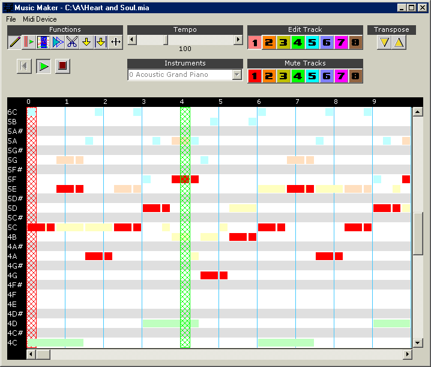



## Music Maker

### Description

This program allows you to create your own midi music. I tried to make the interface easy and efficient to use but I'm sure it could use some improvement. It's similar to MarioPaint's music designer. Some planned improvements:

* Improved overall controls

* Semi-transparent highlighting instead of

cross-hatch pattern (Please email me if you know

how to do this)

* Ability to export a Midi (.mid) file

* Drums

* Volume control

* Pitch bending.

I've included some sample songs. Please feel free to leave comments. I'd like to know of any suggestions/criticism etc. you might have. Also, I'd really appreciate it if you'd vote for me. Thanks!

Update: I just uploaded a newer version. The main difference is that the form is now resizable. Also, you can place the red column by clicking on the top black bar. While you have an area selected you can now transpose just that section and you can assign an instrument to all the selected notes of the current track. I think I added some more stuff too but I can't remember now.
 
### More Info
 

             |
---                |---
**Submitted On**   |2001-07-27 04:04:40
**By**             |[Jeremiah Hughes](https://github.com/Planet-Source-Code/PSCIndex/blob/master/ByAuthor/jeremiah-hughes.md)
**Level**          |Advanced
**User Rating**    |5.0 (100 globes from 20 users)
**Compatibility**  |VB 6\.0
**Category**       |[Sound/MP3](https://github.com/Planet-Source-Code/PSCIndex/blob/master/ByCategory/sound-mp3__1-45.md)
**World**          |[Visual Basic](https://github.com/Planet-Source-Code/PSCIndex/blob/master/ByWorld/visual-basic.md)
**Archive File**   |[Music Make235957272001\.zip](https://github.com/Planet-Source-Code/jeremiah-hughes-music-maker__1-25240/archive/master.zip)

